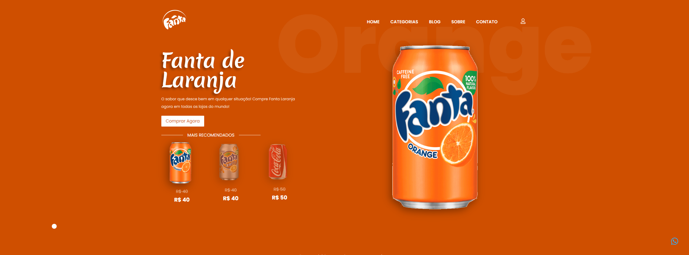
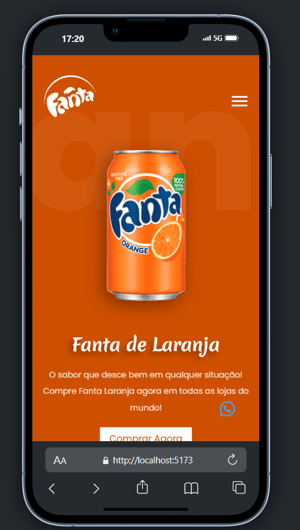

<a href="">Clique aqui para ter acesso ao projeto.</a>

<h1>Modern Layout Fanta</h1>

Este projeto foi desenvolvido utilizando as tecnologias REACT, Tailwind, e Framer Motion. Nele, abordamos a integração de bibliotecas como React Icons e Mouse Follower para proporcionar uma animação agradável e envolvente ao cursor. Usamos o hook `useState` do REACT para gerenciamento de estados, como a mudança do background da aplicação, e aplicamos propriedades dinâmicas para tornar a aplicação mais interativa e organizada. Com o Framer Motion, implementamos animações complexas utilizando variáveis definidas dentro da própria aplicação. No Tailwind, aplicamos conceitos cruciais de responsividade, como o uso de `grid-template-columns` e `position: absolute` para controlar a posição dos elementos e garantir que as animações ocorressem conforme o esperado. Este projeto foi fundamental para consolidar meus conhecimentos em desenvolvimento front-end e práticas modernas de design.

Este projeto também está responsivo para telas menores e dispositívos móveis.

<h1>ING</h1>

This project was developed using REACT, Tailwind, and Framer Motion technologies. In it, we cover the integration of libraries such as React Icons and Mouse Follower to provide a pleasant and engaging cursor animation. We use REACT's `useState` hook to manage states, such as changing the application's background, and apply dynamic properties to make the application more interactive and organized. With Framer Motion, we implement complex animations using variables defined within the application itself. At Tailwind, we applied crucial responsiveness concepts such as using `grid-template-columns` and `position: absolute` to control the position of elements and ensure animations ran as expected. This project was fundamental for consolidating my knowledge in front-end development and modern design practices.

This project is also responsive for smaller screens and mobile devices.
